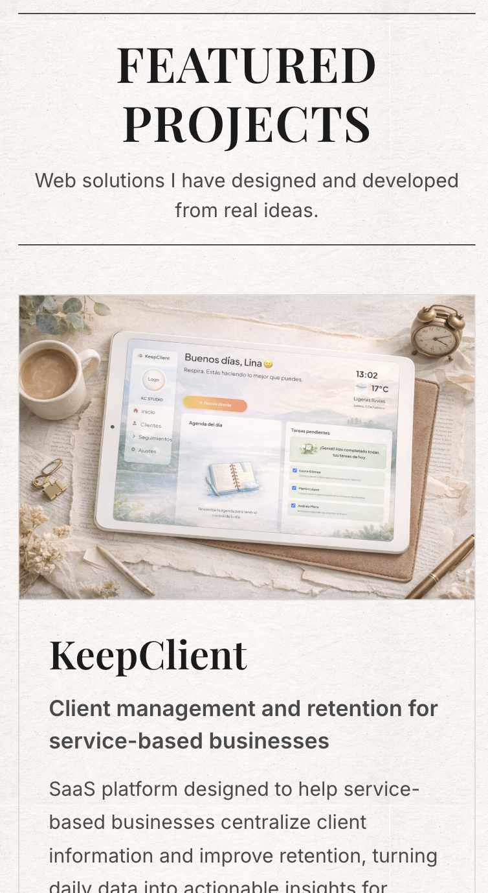
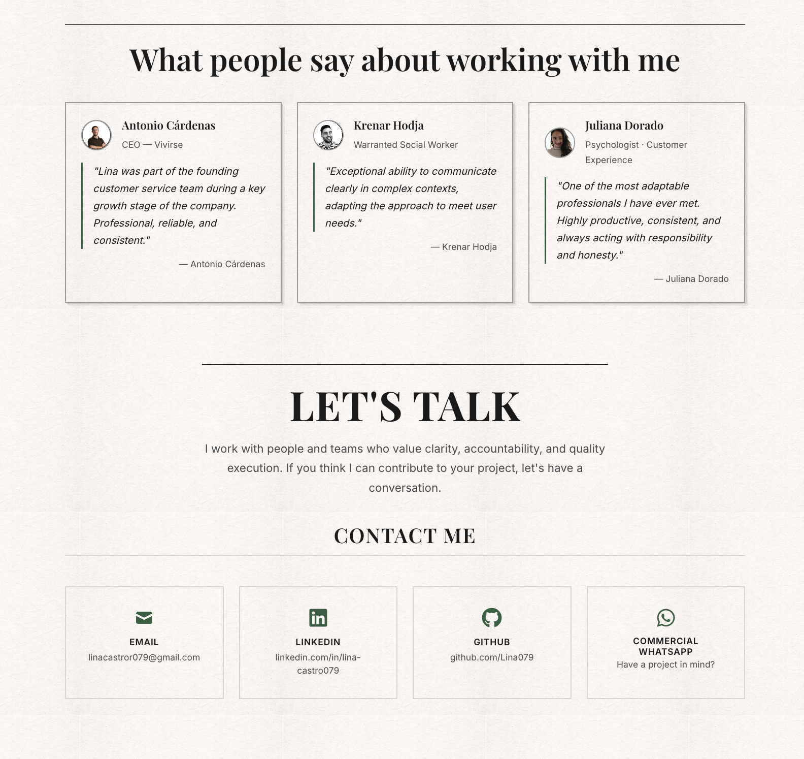

# Portfolio Profesional - Lina Castro

Portfolio web profesional con diseño editorial tipo periódico, desarrollado en React + Vite.

🌐 **Ver en vivo:** [linacastrodev.vercel.app](https://linacastrodev.vercel.app)

---

## 📸 Preview

### Vista Desktop


### Vista Mobile


### Sección Contacto


---

## 📋 Sobre el Proyecto

Portfolio personal diseñado para mostrar proyectos, experiencia y habilidades como Full-Stack Developer. El diseño se inspira en la estética editorial clásica de periódicos, con una interfaz limpia, funcional y bilingüe (Español/Inglés).

### ✨ Características principales

- 🌍 **Bilingüe:** Sistema completo ES/EN con Context API
- 📱 **Responsive:** Adaptado a todos los dispositivos (mobile-first)
- 🎨 **Diseño editorial:** Estética tipo periódico con textura de papel
- ⚡ **Animaciones sutiles:** Framer Motion para transiciones suaves
- 🎯 **Optimizado:** Build con Vite, deploy en Vercel
- 🧩 **Modular:** Componentes reutilizables con arquitectura clara

---

## 🛠️ Tech Stack

### Frontend
- **React 18** - Biblioteca UI
- **Vite** - Build tool y dev server
- **Framer Motion** - Animaciones
- **React Icons** - Iconografía

### Estilos
- **CSS3 puro** - Sin frameworks (BEM naming)
- **Variables CSS** - Sistema de diseño consistente
- **Google Fonts** - Playfair Display + Inter

### Deploy
- **Vercel** - Hosting y CI/CD
- **GitHub** - Control de versiones

---

## 📂 Estructura del Proyecto
```
portfolio-lina/
├── public/
│   ├── logo-linaC.jpg
│   └── index.html
├── src/
│   ├── assets/
│   │   ├── images/          # Imágenes de proyectos, fotos, etc.
│   │   └── textures/        # Textura de papel de fondo
│   ├── components/
│   │   ├── Header/
│   │   ├── Hero/
│   │   ├── ProjectsGrid/
│   │   ├── ProjectCard/
│   │   ├── AboutSection/
│   │   ├── Testimonials/
│   │   ├── ContactSection/
│   │   └── Footer/
│   ├── context/
│   │   └── LanguageContext.jsx    # Sistema bilingüe
│   ├── styles/
│   │   ├── base/                  # Variables, tipografía, layout
│   │   └── blocks/                # Estilos por componente
│   ├── App.jsx
│   ├── main.jsx
│   └── index.css
├── package.json
└── vite.config.js
```

---

## 🚀 Instalación Local

### Requisitos previos
- Node.js 18+ 
- npm o yarn

### Pasos

1. **Clonar el repositorio**
```bash
git clone https://github.com/Lina079/portfolio-lina.git
cd portfolio-lina
```

2. **Instalar dependencias**
```bash
npm install
```

3. **Ejecutar en desarrollo**
```bash
npm run dev
```

4. **Abrir en navegador**
```
http://localhost:5173
```

### Scripts disponibles
```bash
npm run dev          # Servidor de desarrollo
npm run build        # Build de producción
npm run preview      # Preview del build
npm run lint         # Linter ESLint
```

---

## 📄 Secciones del Portfolio

1. **Header** - Navegación bilingüe tipo periódico clásico
2. **Hero** - Presentación con imagen flotante y CTA
3. **Proyectos** - Grid 2x2 con 4 proyectos destacados
4. **Sobre mí** - Biografía, foto y video placeholder
5. **Testimonios** - 3 recomendaciones profesionales
6. **Contacto** - Links directos (Email, LinkedIn, GitHub, WhatsApp)
7. **Footer** - Firma editorial minimalista

---

## 🎨 Sistema de Diseño

### Paleta de colores
- **Fondo:** `#fafaf8` (blanco cálido)
- **Texto primario:** `#1a1a1a` (charcoal)
- **Texto secundario:** `#4a4a4a` (gris medio)
- **Acento:** `#2d5f3f` (verde editorial)

### Tipografía
- **Títulos:** Playfair Display (serif)
- **Cuerpo:** Inter (sans-serif)

### Espaciado
Sistema modular base 8px (`--space-xs` a `--space-3xl`)

---

## 📱 Responsive Breakpoint

- **Desktop:** > 900px
- **Mobile:** ≤ 900px

---

## 🔗 Links

- **Portfolio en vivo:** [linacastrodev.vercel.app](https://linacastrodev.vercel.app)
- **GitHub:** [github.com/Lina079](https://github.com/Lina079)
- **LinkedIn:** [linkedin.com/in/lina-castro079](https://www.linkedin.com/in/lina-castro079)

---

## 📧 Contacto

**Lina Castro**  
Full-Stack Developer  
📍 Málaga, España

- Email: linacastror079@gmail.com
- LinkedIn: [lina-castro079](https://www.linkedin.com/in/lina-castro079)
- GitHub: [@Lina079](https://github.com/Lina079)

---

## 📝 Licencia

Este proyecto es de código abierto para fines educativos. El contenido y diseño son propiedad de Lina Castro.

---

**Desarrollado con ☕ y propósito en Málaga, España**
